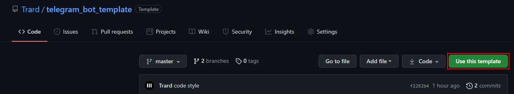
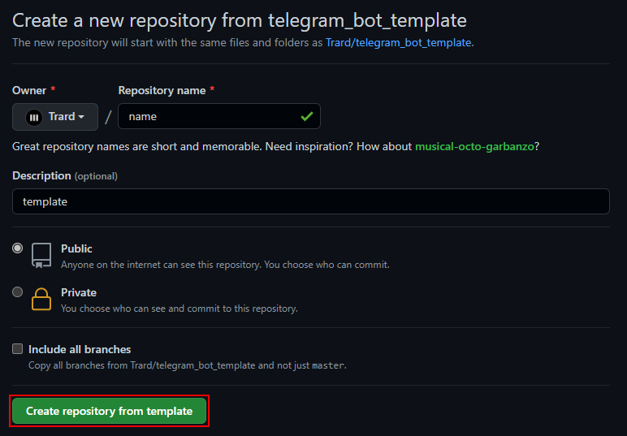

# Template

## Setup

### 1. [Create a template repository](https://help.github.com/en/github/creating-cloning-and-archiving-repositories/creating-a-repository-from-a-template) by clicking [here](https://github.com/Trard/telegram_bot_template/generate). Alternatively, you can click the Use this template button:

### 2. Name your repository and click _Create repository from template_.

---
_Inspired by [JasonEtco/activity-box/README.md](https://github.com/JasonEtco/activity-box/blob/master/README.md)_